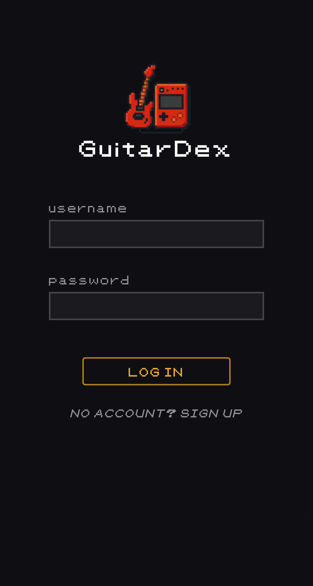
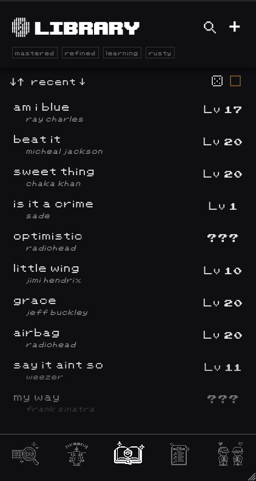
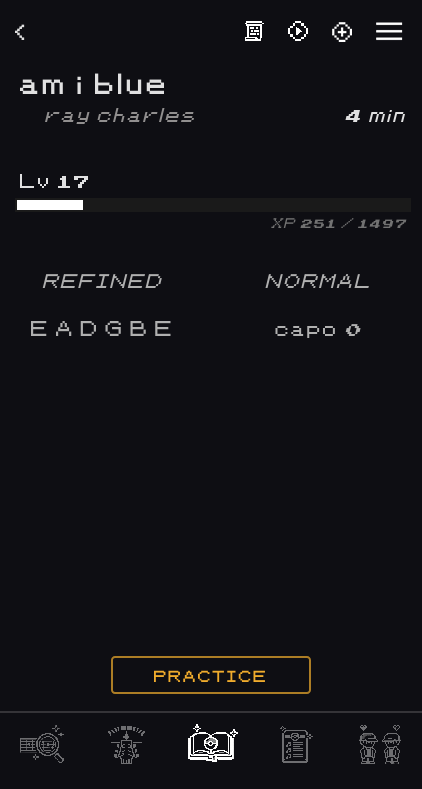
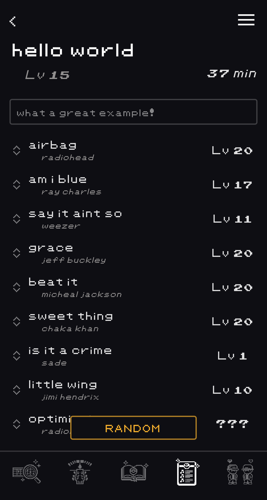
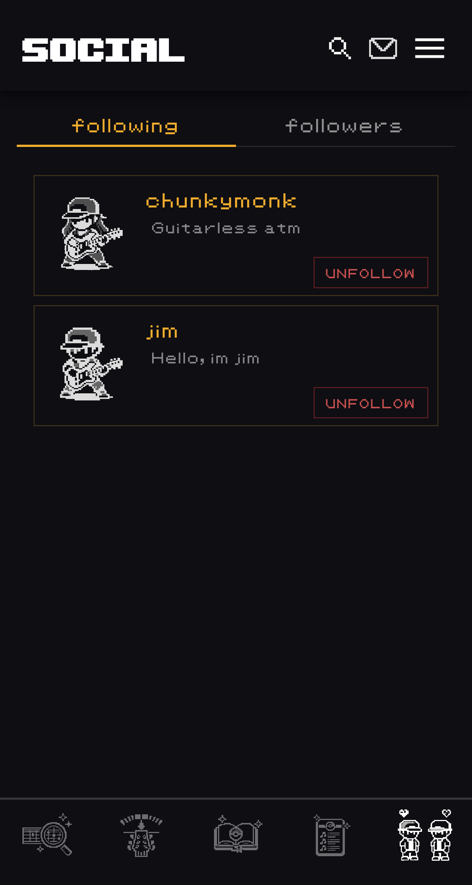
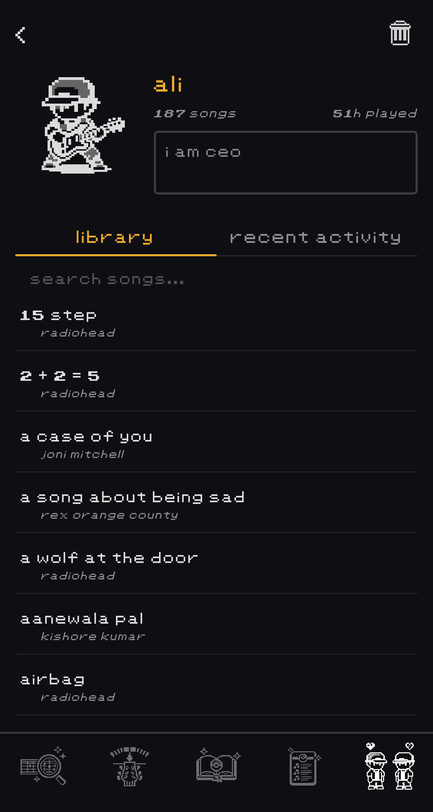
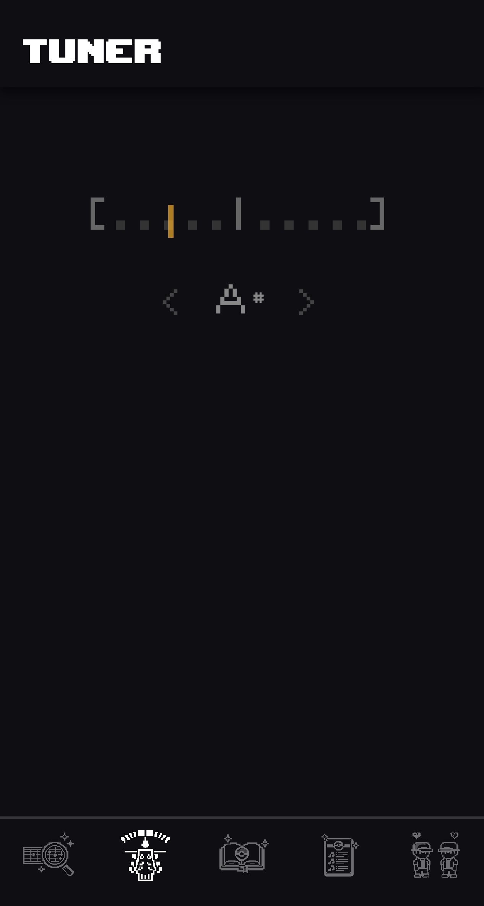
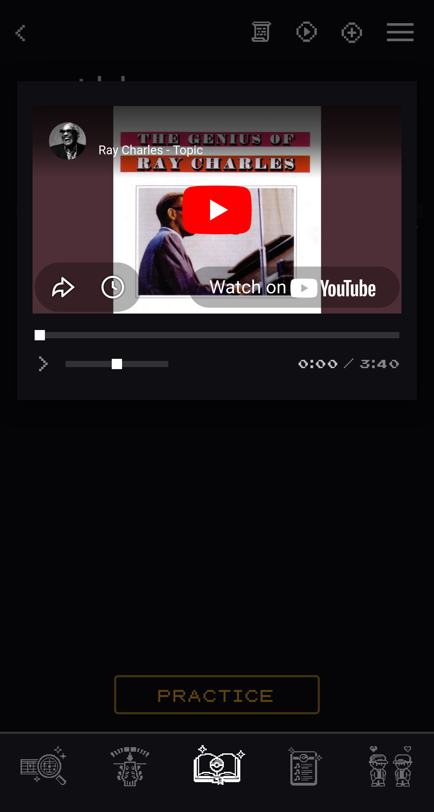

# GuitarDex

GuitarDex is a mobile-first guitar companion app built as a Progressive Web App, designed for real daily practice.

It combines a Pokémon-inspired leveling system with practical tools like a tuner, chord finder, and practice tracking — creating a structured and engaging way to improve over time.

Unlike most guitar apps, GuitarDex focuses on long-term progression, skill retention through decay mechanics, and fast, seamless workflows optimized for mobile use.

Frequently being updated and used daily.

  

## Try it

Visit [guitardex.vercel.app](https://guitardex.vercel.app/) on your phone, tap share, then "Add to Home Screen" to install it as a standalone app.

*(Best experienced on mobile or using Chrome DevTools mobile view)*
## Features

### Leveling System

  
  &nbsp;&nbsp;
  

- Earn XP by logging practice sessions
- XP scales with song difficulty, practice duration, song length, your highest level reached, and streak bonuses
- Songs progress through statuses: **Seen → Learning → Refined → Mastered**
- Manual "bump" action to promote a song when you already know it from memory

### Decay Mechanic

- Songs decay if not practiced within grace periods
- Harder songs decay faster, but decay resistance scales with total practice sessions — the more you've played it, the slower it fades
- Songs that reach **Refined** have a minimum floor at level 5  
- Songs that reach **Mastered** never decay below Refined
- "In danger" warning appears 5 days before a song is about to derank

### Practice Decks & Jam Decks

  

- Organize songs into custom playlists/decks with drag-and-drop reordering
- Track average level and total duration per deck
- **Jam Decks**: collaborative decks shared with another user, with a request/invite flow and mail notifications

### Social

  
  &nbsp;&nbsp;
  

- **Band visibility** – See what your bandmates or friends are currently practicing
- **Shared jam decks** – Build collaborative setlists and instantly see which songs everyone knows
- **Practice awareness** – Identify weak spots before rehearsals by tracking preparation across members

### Tuner

  

- Dedicated tuner page and an inline tuner inside the practice widget
- Real-time pitch detection via Web Audio API + YIN algorithm
- Median-filtered frequency and cents smoothing, RMS amplitude gating, and raw-note switching for snappy, stable readouts

### YouTube Playback & Lyrics

  

- YouTube player integrated into song and practice views with playback controls
- Automatic lyrics fetch via lrclib.net with an approve/reject suggestion flow

### Other Tools

- Interactive SVG fretboard chord finder with clickable notes across 12 frets
- Framer Motion page transitions, staggered list animations, and AnimatePresence modals
- Pokémon-inspired pixel-art aesthetic with custom fonts and pixelated icon rendering

### Cross-Device Sync & PWA Support

- Installable on mobile devices as a standalone app
- All progress, songs, decks, and social data synced across devices in real-time via Supabase
- Seamlessly switch between phone, tablet, and desktop without losing any data

## Tech Stack

- **React 19** + Vite + `vite-plugin-pwa`
- **React Router v7**
- **Framer Motion** — transitions and animations
- **dnd-kit** — drag-and-drop song reordering
- **Supabase** — PostgreSQL, Auth, Realtime
- **Web Audio API** + **pitchfinder** (YIN) — tuner pitch detection
- **lrclib.net** — lyrics API
- **YouTube IFrame API** — embedded playback
