# GuitarDex

Most guitar apps help you learn songs, but struggle to help you maintain them. Instead of forgetting songs over time, GuitarDex is a solo project of mine that tracks your practices, reminds you what needs attention and makes maintaining your personal catalog enjoyable. 

It combines a Pokémon inspired leveling system with practical tools like a tab player, a tuner, metronome, chord finder with a scale mode, and a chord editor for custom chord sheets.

Frequently being updated and used daily.

## Try it

Visit [guitardex.net](https://guitardex.net/) on your phone, tap share, then "Add to Home Screen" to install it as a standalone app.

*(Best experienced on mobile or using Chrome DevTools mobile view)*

  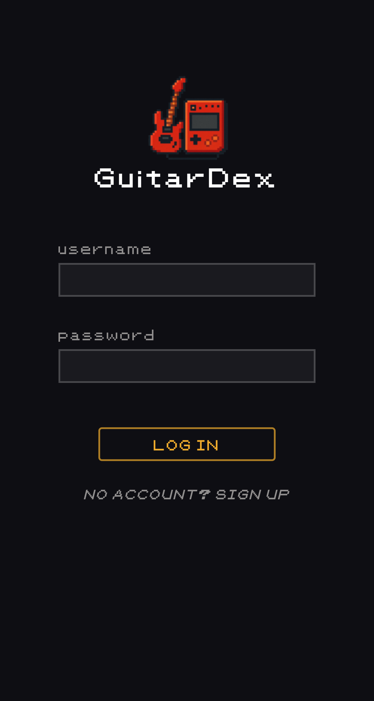

## Features

### Leveling System

  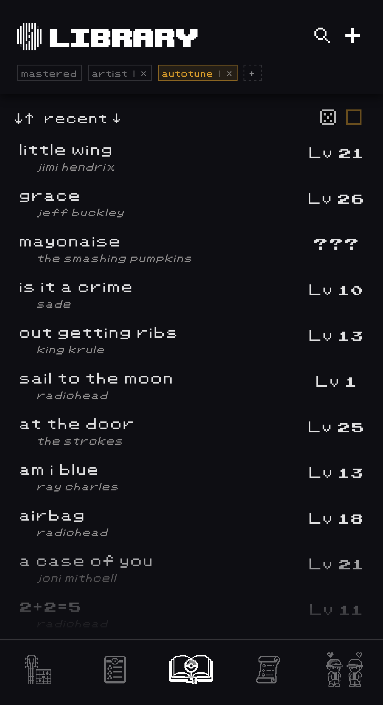
  &nbsp;&nbsp;
  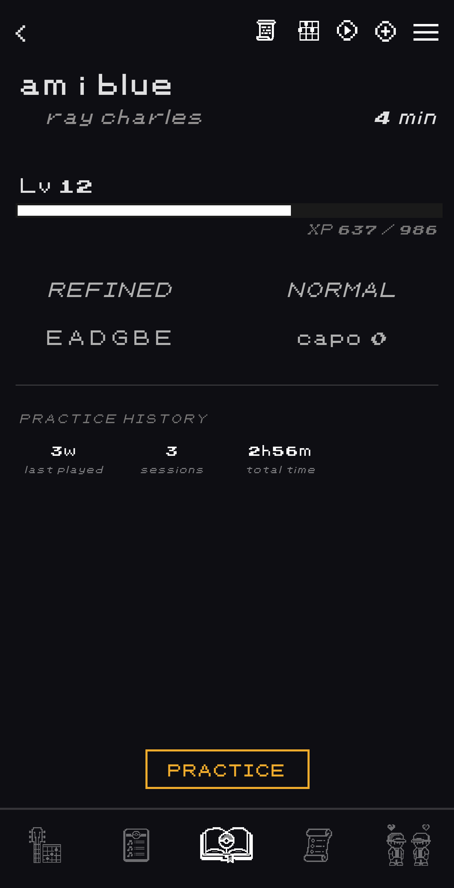

- Earn XP by logging practice sessions
- XP scales with song difficulty, practice duration, your highest level reached, and streak bonuses
- Songs progress through statuses: **Seen → Learning → Refined → Mastered**
- Optional **XP boost** multiplier (up to 3×) to tune how fast you level up
- Pin frequently-played songs to the top of the library, with status filters and search
- Custom filter chips (by artist, difficulty, or tuning) and sort by recent, level, or age
- **Autotune filter** — a smart chip that surfaces every song matching the tuning of your last practice session, so you can see what you can play right now without retuning

### Decay Mechanic

- Songs decay if not practiced within grace periods
- Harder songs decay faster, but decay resistance scales with total practice sessions. The more you've played it, the slower it fades
- Songs that reach **Refined** have a minimum floor at level 5
- Songs that reach **Mastered** never decay below Refined
- Decay rate is adjustable (0.5×–2×) so retention can be as forgiving or as demanding as you like
- Decay can be toggled off entirely from settings

### Practice Insights

  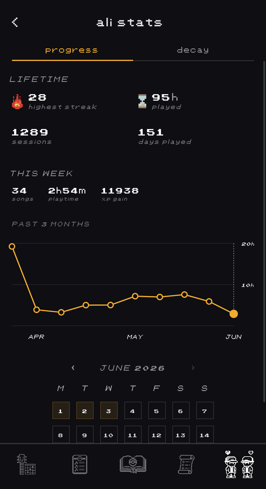

- A stats dashboard that visualizes your practice history with charts
- **Progress** view — track XP, levels, and practice time as they build up
- **Decay** view — see which songs are fading and which are holding steady

### Chord Finder

  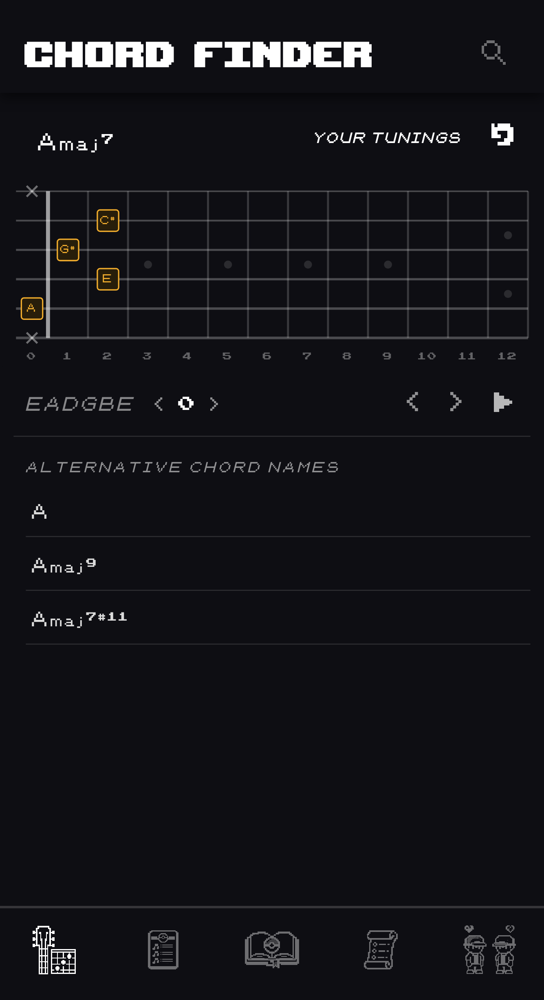
  &nbsp;&nbsp;
  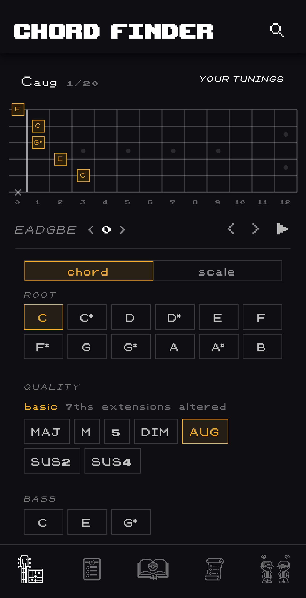

- Interactive SVG fretboard spanning 12 frets, with configurable tuning and capo
- **Discovery mode** — tap notes on the fretboard and it identifies the chord(s) you're forming
- **Search mode — chords** — pick a root, quality, and optional bass note, and it generates up to 20 playable voicings ranked by how clean they are to fret
- **Search mode — scales** — pick a root and a scale type (common / pentatonic / modes) and it maps the scale across the whole neck, then breaks it into hand-position boxes you can cycle through
- **Root drone** — hum a sustained root note in scale mode to practise your scales in key
- Hear any chord or scale out loud with built-in Soundfont audio playback

### Chords and Tabs 

  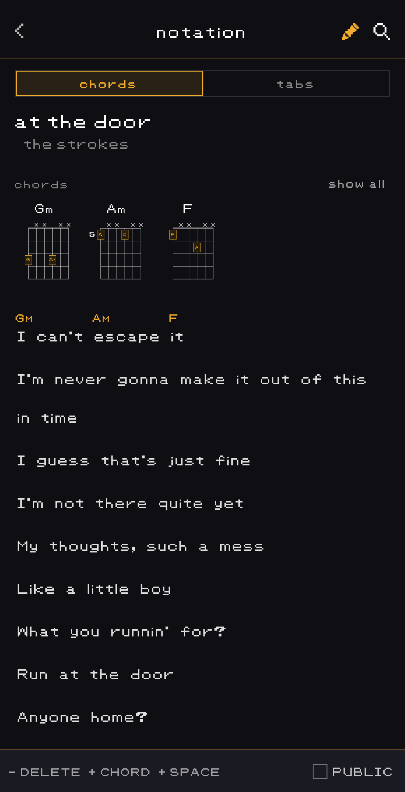
  &nbsp;&nbsp;
  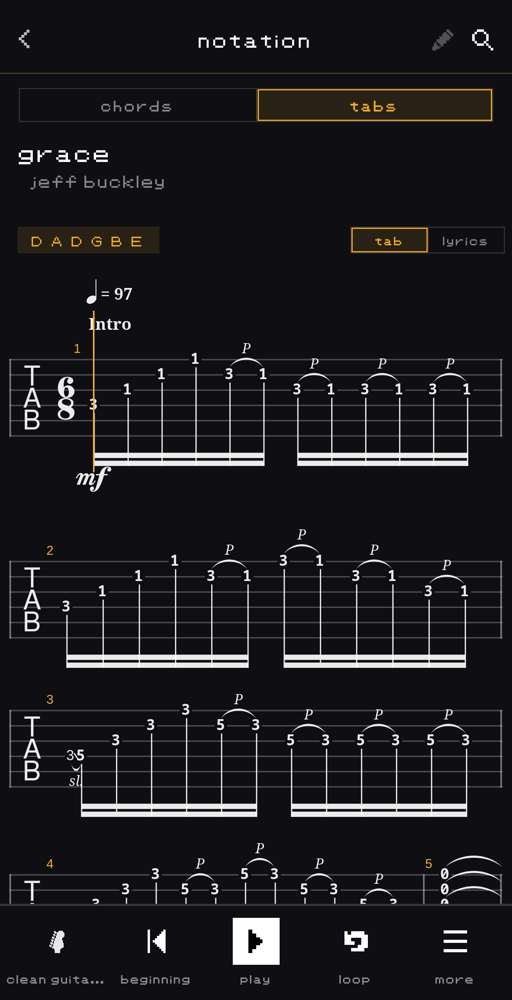

- Build a **chord sheet** for any song in a dedicated editor, lyrics with chords floated above the exact word they land on
- An embedded chord picker lets you place chords straight from the interactive fretboard, no typing
- Import your own tabs and use our tab player
- Tabs sync to YouTube audio so you can follow along note-for-note
- Change playback speed, use a synced metronome, or loop a few tricky bars. 

### Social & Activity Feed

  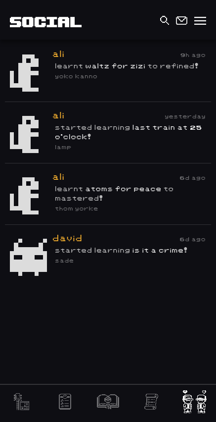
  &nbsp;&nbsp;
  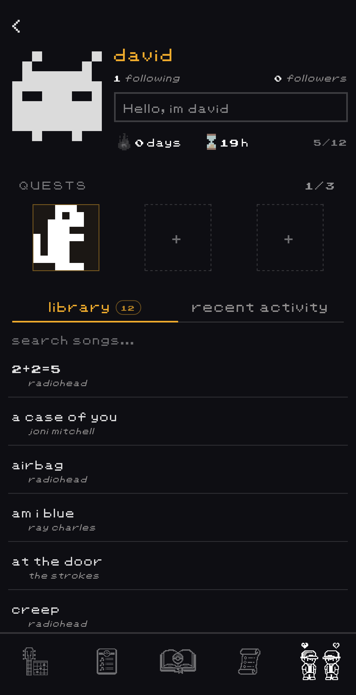
  &nbsp;&nbsp;
  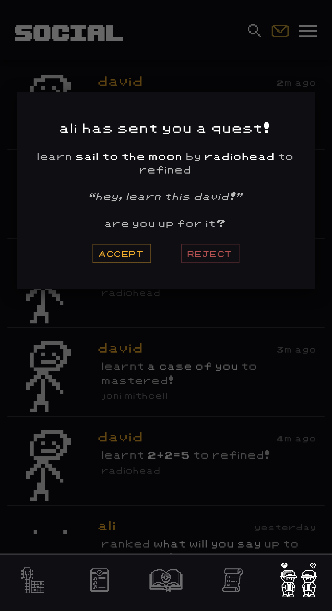

- **Milestone activity feed** — see when friends start learning a song, refine it, or master it
- **Profiles** — public library, recent activity, streak, total hours played
- **Friends** — follow/follower lists with follow-back, unfollow, and follow-request flows
- **Privacy controls** — hide your activity from others' feeds, hide your practice log, mark new songs private by default, and export/import or delete your data from settings
- **Quests** "learn this song to **Refined** or **Mastered**"
- **Jam Decks**: collaborative decks shared with another user, with a request/invite flow and mail notifications

### Themes

  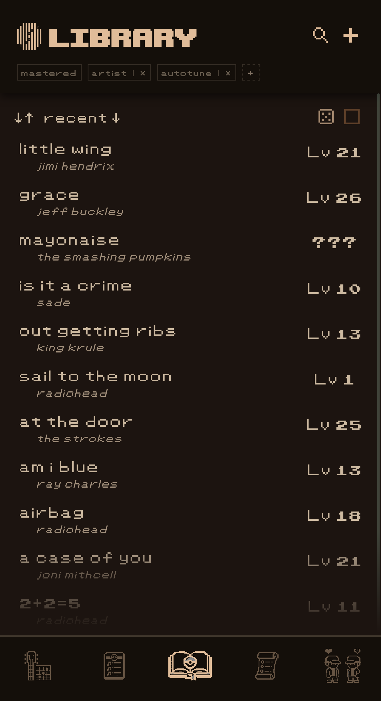
  &nbsp;
  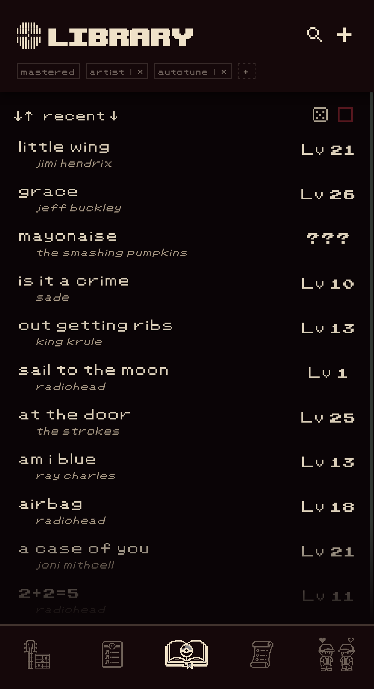

- Three dark themes: **original**, **dirt**, and **crimson**

### Tools

  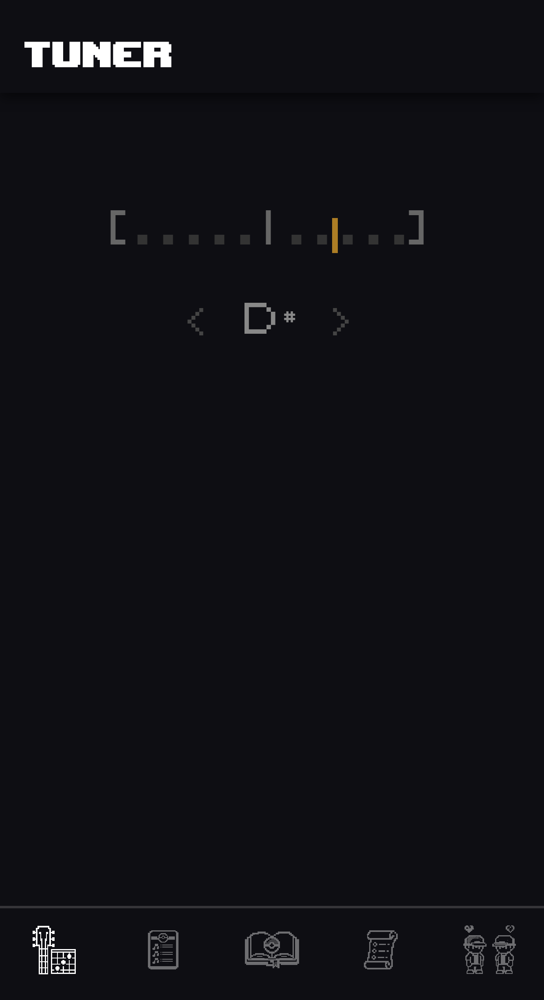
  &nbsp;&nbsp;
  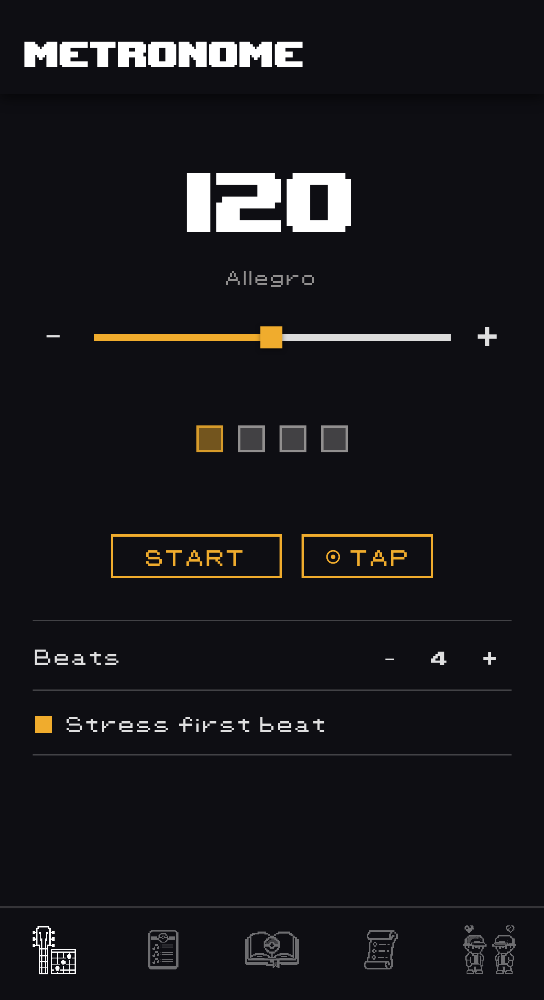
  &nbsp;&nbsp;
  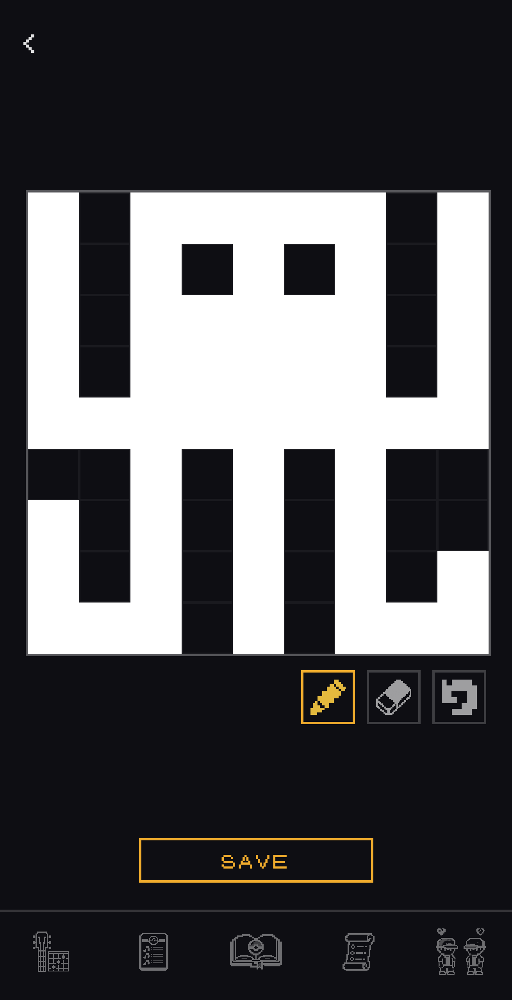

- Dedicated tuner page and an inline tuner inside the practice widget that auto uses the current song's tuning
- Built-in metronome with a sample-accurate Web Audio scheduler for rock-solid timing
- **Tap tempo** — tap out a beat to set the BPM by feel
- Accent the first beat and set beats-per-measure

### YouTube Playback & Karaoke

  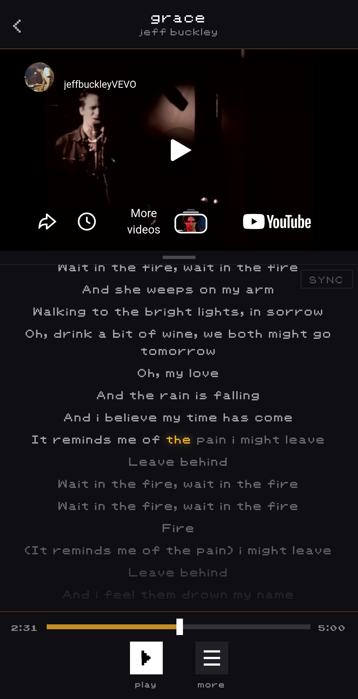

- YouTube player integrated into song and practice views with playback controls
- Automatic lyrics fetch via lrclib.net
- **Full-page karaoke player** with synced lyric scrolling alongside playback
- **Per-word karaoke** for songs with tabs timing each word highlights as it's sung, and you can tap any word to seek there

### Cross-Device Sync & PWA Support

- Installable on mobile devices as a standalone app
- All progress, songs, decks, and social data synced across devices in real-time via Supabase
- Seamlessly switch between phone, tablet, and desktop without losing any data

## Tech Stack

- **React 19** + Vite + `vite-plugin-pwa`
- **React Router v7**
- **Framer Motion** — transitions and animations
- **dnd-kit** — drag-and-drop song reordering
- **Supabase** — PostgreSQL, Auth, Realtime, Row Level Security
- **Web Audio API** + **pitchfinder** (YIN) — tuner pitch detection and metronome scheduling
- **smplr** — Soundfont-based chord audio playback
- **AlphaTab** — Guitar Pro tab rendering and playback
- **lrclib.net** — lyrics API
- **YouTube IFrame API** — embedded playback
